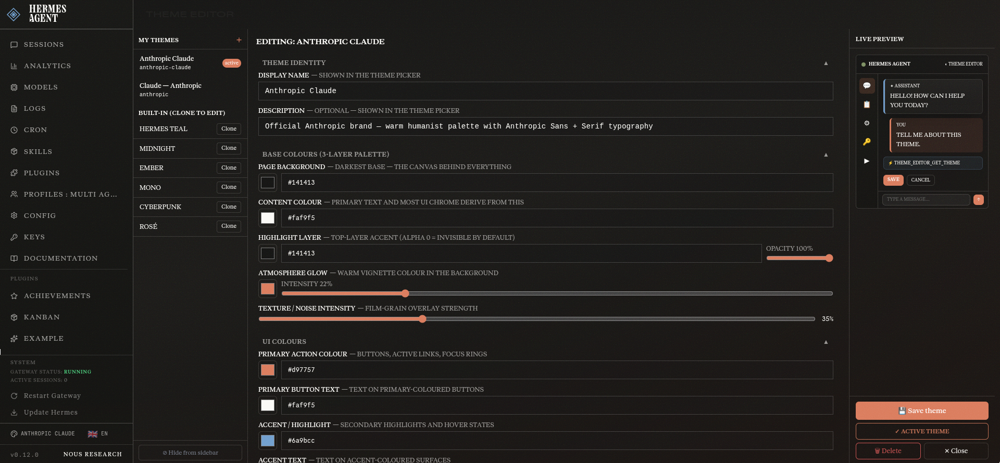

# hermes-theme-editor

> Visual theme editor plugin for the [Hermes Agent](https://github.com/NousResearch/hermes-agent) dashboard.

Create, preview, and activate custom dashboard themes without editing YAML by hand.
The editor appears as a native **Themes** tab inside the Hermes Agent web dashboard.



---

## Features

- **Native dashboard tab** — integrates via the Hermes Agent dashboard plugin system, no separate server needed
- **Full YAML theme support** — edits the exact `~/.hermes/dashboard-themes/*.yaml` format consumed by Hermes Agent
- **Visual palette editor** — hex + alpha pickers for background, midground, foreground, warm glow, and noise opacity
- **Typography controls** — sans-serif, monospace, and display font pickers with 20 popular open-source Google Fonts; custom URL support (Google Fonts, Bunny Fonts, jsDelivr, …)
- **Layout controls** — border radius, density (compact / comfortable / spacious), layout variant (standard / cockpit / tiled)
- **Color overrides** — all 18 shadcn-compat tokens (primary, accent, destructive, success, warning, border, ring, …)
- **Custom CSS** — raw CSS textarea injected on theme apply (32 KiB cap)
- **Live preview** — palette, font, and radius applied instantly as you type
- **Built-in + user themes** — list, activate, clone, and delete from one screen
- **Multilingual UI** — English, Hungarian, Chinese; adapts to the host dashboard locale
- **LLM tools** — `theme_editor_list_themes`, `theme_editor_save_theme`, etc. for AI-assisted theme creation
- **Slash command** — `/theme-editor` prints a theme list and usage hint
- **CLI subcommands** — `hermes theme-editor list|get|delete`

---

## Requirements

| Dependency | Version |
|---|---|
| Hermes Agent | ≥ 0.11.0 |
| Python | ≥ 3.11 |
| PyYAML | ≥ 6.0 |
| FastAPI | ≥ 0.110 |
| Pydantic | ≥ 2.6 |

---

## Installation

### Quick install (recommended)

```bash
git clone https://github.com/sanchomuzax/hermes-theme-editor.git
cd hermes-theme-editor
./install.sh
```

The script symlinks the repo into `~/.hermes/plugins/hermes-theme-editor/` and attempts to enable it via `hermes plugins enable`.

### Manual install

```bash
# 1. Clone
git clone https://github.com/sanchomuzax/hermes-theme-editor.git ~/.hermes/plugins/hermes-theme-editor

# 2. Enable in ~/.hermes/config.yaml
#    plugins:
#      enabled:
#        - hermes-theme-editor

# 3. Restart Hermes Agent
```

### Remove

```bash
./install.sh --remove
```

---

## Usage

### Dashboard tab

After installation, open the Hermes Agent web dashboard — a **Themes** tab will appear in the navigation. From there you can:

1. **Browse** built-in and user themes
2. **Activate** any theme with one click
3. **Clone** any theme as a starting point
4. **Create** a new theme with the visual editor
5. **Edit** any user theme you created

### Slash command

```
/theme-editor
```

Lists your user themes and reminds you where the dashboard tab is.

### CLI

```bash
hermes theme-editor list          # list all user themes
hermes theme-editor get my-theme  # print theme YAML
hermes theme-editor delete my-theme
```

### AI-assisted theme creation

Ask the agent:

> "Create a dark purple theme called 'amethyst' with Inter font and soft corners"

The agent uses the `theme_editor_save_theme` tool to write the YAML directly to `~/.hermes/dashboard-themes/`.

---

## Theme format

Themes follow the Hermes Agent YAML schema. Example:

```yaml
name: my-custom-theme
label: "My Custom Theme"
description: "Dark teal with warm accents"

palette:
  background: "#0d1b2a"
  midground: "#f0e6d3"
  foreground:
    hex: "#ffffff"
    alpha: 0
  warmGlow: "rgba(255, 165, 0, 0.30)"
  noiseOpacity: 0.8

typography:
  fontSans: '"Inter", system-ui, sans-serif'
  fontMono: '"JetBrains Mono", ui-monospace, monospace'
  fontUrl: "https://fonts.googleapis.com/css2?family=Inter:wght@300;400;500;700&family=JetBrains+Mono:wght@400;500;700&display=swap"
  baseSize: "15px"
  lineHeight: "1.6"
  letterSpacing: "0"

layout:
  radius: "0.5rem"
  density: "comfortable"

colorOverrides:
  primary: "#4f9cf9"
  accent: "#f97316"
  success: "#22c55e"
  warning: "#f59e0b"
  destructive: "#ef4444"

customCSS: |
  :root[data-theme="my-custom-theme"] ::selection {
    background: rgba(79, 156, 249, 0.28);
  }
```

Saved files land in `~/.hermes/dashboard-themes/my-custom-theme.yaml` and are immediately available in the dashboard theme picker.

---

## Security

- Font URLs are validated against an allowed-domain whitelist (Google Fonts, Bunny Fonts, jsDelivr, cdnfonts.com)
- Theme slugs are validated with `^[a-z0-9][a-z0-9\-]{0,62}[a-z0-9]$` to prevent path traversal
- All YAML is read with `yaml.safe_load` — no arbitrary code execution
- YAML writes are atomic (temp file + `os.replace`) to prevent corruption
- `customCSS` is capped at 32 KiB (matches Hermes Agent limit)
- No secrets, tokens, or credentials are ever written to the plugin directory

---

## Development

```bash
# Install dev dependencies
pip install -e ".[dev]"

# Run tests
pytest

# Run with coverage
pytest --cov --cov-report=term-missing
```

### Project structure

```
hermes-theme-editor/
├── plugin.yaml          # Hermes plugin manifest
├── __init__.py          # register(ctx) entry point
├── schemas.py           # LLM tool schemas
├── tools.py             # LLM tool handlers
├── commands.py          # slash + CLI commands
├── hooks.py             # lifecycle hooks
├── config.py            # paths and constants
├── themes/
│   ├── repository.py    # YAML CRUD (~/.hermes/dashboard-themes/)
│   └── validator.py     # input validation
├── dashboard/
│   ├── manifest.json    # dashboard plugin manifest
│   ├── plugin_api.py    # FastAPI router (/api/plugins/hermes-theme-editor/)
│   └── dist/
│       └── index.js     # Theme Editor UI (IIFE, no build step)
└── tests/
    ├── unit/            # validator + repository tests
    └── integration/     # API endpoint tests
```

---

## Contributing

PRs welcome. Please:

1. Write tests first (TDD)
2. Run `pytest --cov` and keep coverage ≥ 80 %
3. Follow the [Keep a Changelog](https://keepachangelog.com) format in `CHANGELOG.md`
4. Do not commit any credentials or secrets

---

## License

[MIT](LICENSE) © 2026 sanchomuzax
